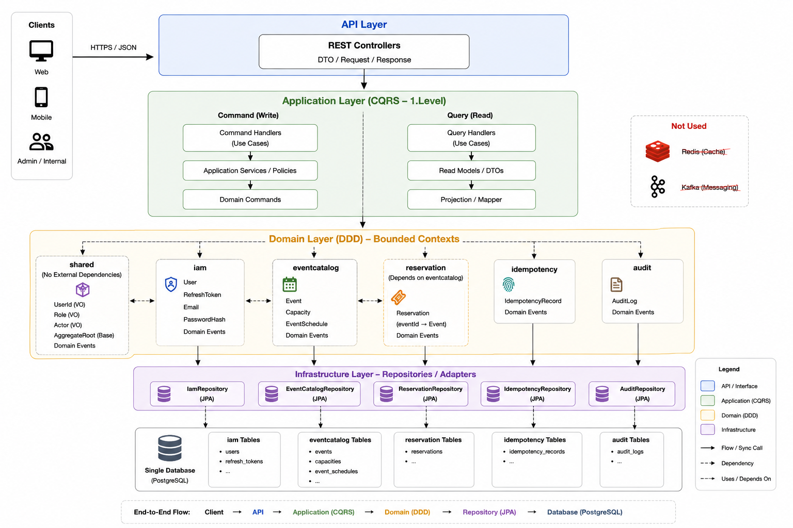
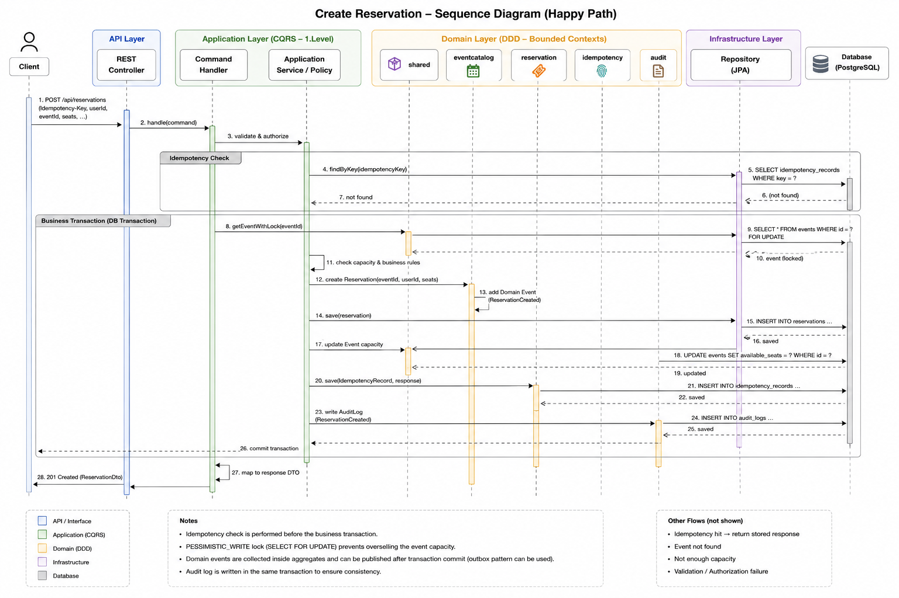
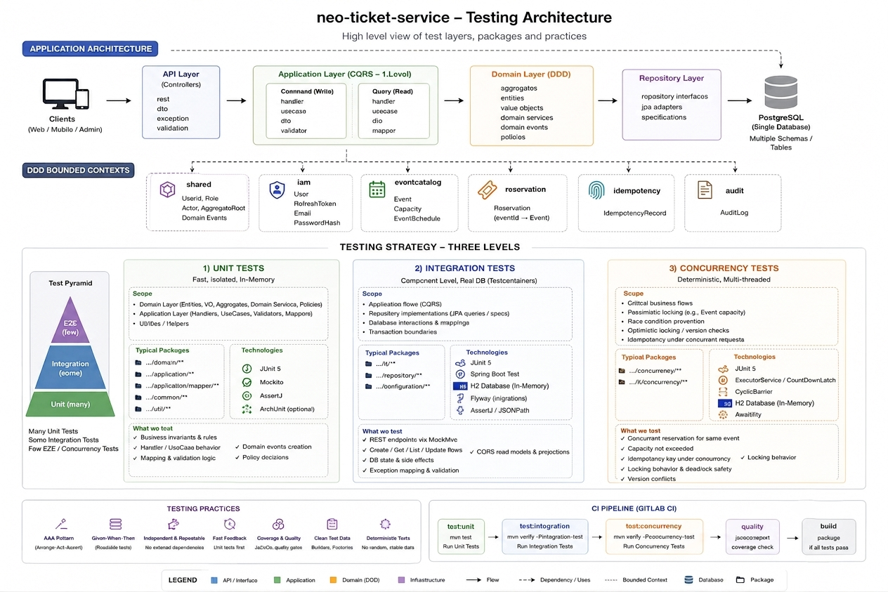

# neo-ticket-service

Secure ticketing & reservation API — **Java 25**, **Spring Boot 4**, PostgreSQL.

An organizer publishes events with a fixed seat capacity; customers hold, confirm and cancel
seats against them. The interesting part of the service is not the CRUD but the guarantees around
it: capacity must never be oversold under concurrency, a retried request must not book twice, and
every state change must leave an audit trail.

---

## What it does

| Actor | Can |
| --- | --- |
| `CUSTOMER` | Browse published events, hold seats, confirm or cancel their own reservations |
| `ORGANIZER` | Create, update and publish their own events |
| `ADMIN` | Act on any event, read operational endpoints |

**Core rules enforced in the domain:**

- Seats can never be oversold — capacity is checked and decremented under a database lock.
- A reservation holds at most **10** seats and belongs to exactly one event and one user.
- An event's schedule cannot change after publication; capacity may only grow.
- Only the owner (or an admin) may modify an event or a reservation.
- A retried `POST` carrying the same `Idempotency-Key` returns the original result instead of
  booking again.

---

## Architecture



Four layers, one direction of dependency — the domain has no knowledge of Spring, HTTP or JPA:

```text
API  →  Application (CQRS)  →  Domain (DDD)  →  Repository  →  PostgreSQL
```

Six **bounded contexts** live in one deployable and share one database, each owning its own
tables. They are logical boundaries, not microservices:

| Context | Owns | Notes |
| --- | --- | --- |
| `shared` | `UserId`, `Role`, `Actor`, `AggregateRoot`, domain events, error model | No external dependencies |
| `iam` | `User`, `RefreshToken`, `Email`, `PasswordHash` | JWT issuing, refresh-token rotation |
| `eventcatalog` | `Event`, `Capacity`, `EventSchedule` | Owns the seat count |
| `reservation` | `Reservation` | References `eventcatalog` by `EventId` only |
| `idempotency` | `IdempotencyRecord` | Cross-cutting, supports write endpoints |
| `audit` | `AuditLog` | Cross-cutting, fed by domain events |

Contexts reference each other **by ID only** — no cross-context object graphs, no shared
aggregates.

### CQRS — level 1

Commands and queries are separated at the application layer only. Same aggregate, same
repository, same database — no event sourcing, no separate read store.

```text
Command → Command Handler → Domain → Repository
Query   → Query Handler   → Repository → Read DTO
```

Rationale and rejected alternatives: [ADR 0001](docs/adr/ADR_0001_%20Using_DDD_and_Lightweight_CQRS.md).

---

## How a request flows



Holding a seat is the flow where all the guarantees meet:

1. **Idempotency check** — the `Idempotency-Key` is looked up *before* the business transaction.
   A hit replays the stored response; a miss claims the key via a unique constraint on
   `(idempotency_key, endpoint, user_id)`, so a concurrent duplicate loses the race instead of
   double-booking. ([ADR 0003](docs/adr/ADR_0003_Idempotent_Reservations_via_Claim_Row.md))
2. **Pessimistic lock** — the event row is read `FOR UPDATE`, so two requests cannot both see the
   same free capacity. Lower-contention updates rely on optimistic `@Version` instead.
   ([ADR 0002](docs/adr/ADR_0002_Using_Optimistic_and_Pessimistic_Locking.md))
3. **Domain decides** — the `Event` aggregate checks the rules and reserves the seats; the
   `Reservation` aggregate is created and raises `ReservationCreated`.
4. **Audit** — the domain event is consumed and written to `audit_logs` in the same transaction.
   ([ADR 0006](docs/adr/ADR_0006_Audit_Logging_via_Domain_Events.md))
5. **Response recorded** — the serialized response is stored against the idempotency key so a
   retry can replay it.

Errors never leak internals: every failure becomes an RFC 7807 `application/problem+json` body
carrying a stable machine-readable `errorCode` and the `requestId`.
([ADR 0004](docs/adr/ADR_0004_HTTPStatus_and_Application_Error_Codes.md),
[ADR 0005](docs/adr/ADR_0005_%20Do_Not_Expose_Internal_Errors_to_Clients.md))

---

## DDD & design patterns — in brief

| Pattern | Where |
| --- | --- |
| Aggregate Root | `Event`, `Reservation`, `User` — the only entry points for state change |
| Value Object | `Email`, `PasswordHash`, `Capacity`, `EventSchedule`, `UserId`, `Actor` — immutable, self-validating |
| Domain Event | `ReservationCreated`, `EventPublished`, … raised by aggregates, drained on save |
| Repository (Port/Adapter) | Domain declares the interface, `infrastructure/persistence` provides the JPA adapter |
| Command / Query separation | Separate handlers per use case in the application layer |
| Specification | `JpaSpecificationExecutor` for composable event search filters |
| Anti-Corruption via IDs | `Reservation` holds an `EventId`, never an `Event` |
| Invariant guard | `Invariants.require*` — one place for domain precondition failures |
| Optimistic + Pessimistic locking | `@Version` where contention is low, `FOR UPDATE` where it is not |
| Idempotency claim row | Unique constraint as the concurrency boundary |

---

## API

| Method | Path | Access |
| --- | --- | --- |
| `POST` | `/api/auth/register` | public |
| `POST` | `/api/auth/login` | public |
| `POST` | `/api/auth/refresh` | public |
| `GET` | `/api/events/public` | public |
| `POST` | `/api/events` | `ORGANIZER` |
| `PUT` | `/api/events/{id}` | owner / `ADMIN` |
| `POST` | `/api/events/{id}/publish` | owner / `ADMIN` |
| `GET` | `/api/events` · `/api/events/{id}` | authenticated |
| `POST` | `/api/events/{eventId}/reservations` | `CUSTOMER` — **requires `Idempotency-Key`** |
| `POST` | `/api/reservations/{id}/confirm` · `/cancel` | holder / `ADMIN` |
| `GET` | `/api/reservations/{id}` | holder / `ADMIN` |

Stateless JWT (HS256), access token 15 min, refresh token 7 days with rotation and
replay detection. Interactive docs at `/swagger-ui.html`, spec at `/v3/api-docs`.

---

## Running it

```bash
mvn spring-boot:run          # dev profile, in-memory H2, seeds 3 demo accounts
```

Demo accounts (dev only): `admin@neo.io`, `organizer@neo.io`, `customer@neo.io` — password
`neo-dev-password`.

```bash
docker build -t neo-ticket-service .
docker run -p 8080:8080 -e SPRING_PROFILES_ACTIVE=postgres \
  -e NEO_DB_URL=... -e NEO_DB_USER=... -e NEO_DB_PASSWORD=... -e NEO_JWT_SECRET=... \
  neo-ticket-service
```

| Profile | Database | Seed data |
| --- | --- | --- |
| `dev` (default) | H2 in-memory | yes |
| `test` | H2 in-memory, fresh per context | no |
| `postgres` | PostgreSQL via env vars | no |

Flyway owns the schema (`src/main/resources/db/migration`); Hibernate runs with
`ddl-auto: validate` and only checks the mapping against it.

---

## Testing strategy



Three levels, split by **behaviour rather than class name**. Every integration-style test is
annotated with the project's own `@IntegrationTest`, which carries a JUnit 5 `@Tag("integration")`
— so a new test is classified automatically and CI never needs editing.

| Level | What it covers | Boots Spring? |
| --- | --- | --- |
| **Unit** | Aggregates, value objects and invariants across every context, plus IAM's command handlers against in-memory fakes — JUnit 5 + Mockito + AssertJ | no |
| **Integration** | Full HTTP flow over a random port: security, validation, error mapping, persistence, and the remaining command/query handlers (`reservation`, `eventcatalog`, `idempotency`) | yes |
| **Concurrency** | Overbooking and idempotency under parallel load (e.g. 16 simultaneous requests with one key) | yes |

The domain layer (aggregates, value objects) is unit-tested everywhere. Handler-level unit tests
with fakes exist only for `iam`; the other contexts' application/API/infrastructure layers are
currently exercised only through the integration suite — see the coverage split below.

```bash
mvn test -DexcludedGroups=integration   # unit only — fast feedback
mvn test -Dgroups=integration           # integration + concurrency
mvn clean verify                        # everything + JaCoCo coverage gate
```

Integration and concurrency tests run against **in-memory H2** with the real Flyway migrations
applied, so no external service is needed in CI.

### Coverage

`mvn clean verify` enforces a JaCoCo gate (line ≥ 80%, branch ≥ 70%) against the **full suite**;
the build fails below it.

| Suite | Tests | Line | Branch |
| --- | :-: | --: | --: |
| Unit only | 232 | 48.19% | 50.17% |
| Full suite | 270 | 89.19% | 71.72% |

The gap is real, not a measurement artifact: the domain layer is unit-tested everywhere, but
`reservation`, `eventcatalog` and `idempotency` currently have no handler-level unit tests with
fakes (unlike `iam`) — their application/API/infrastructure code is only exercised by the
integration suite. Unit tests alone would not clear the coverage gate; it is met by design through
the combination of both levels.

```bash
open target/site/jacoco/index.html      # line-by-line HTML report
```

---

## Build & deploy

`.gitlab-ci.yml` — four stages:

```text
build  →  unit-test  →  integration-test  →  deploy
```

Kubernetes manifests under `.deploy/`, Kustomize base + overlays:

```text
.deploy/
├── base/                 Deployment, Service, ConfigMap, Secret, ServiceAccount
└── overlays/
    ├── stage/            1 replica, debug logging
    └── production/       HPA, PodDisruptionBudget, pod anti-affinity
```

```bash
kubectl apply -k .deploy/overlays/stage
```

The container runs as a non-root user with a read-only root filesystem. Liveness and readiness
probes hit `/actuator/health/liveness` and `/actuator/health/readiness`; Prometheus metrics are
exposed at `/actuator/prometheus` and restricted to `ADMIN`.
([ADR 0007](docs/adr/ADR_0007_Application_Monitoring_and_Health_Checks.md))

---

## Documentation

**Decisions taken** — [`docs/adr/`](docs/adr)

1. [Using DDD and Lightweight CQRS](docs/adr/ADR_0001_%20Using_DDD_and_Lightweight_CQRS.md)
2. [Optimistic and Pessimistic Locking](docs/adr/ADR_0002_Using_Optimistic_and_Pessimistic_Locking.md)
3. [Idempotent Reservations via a Claim Row](docs/adr/ADR_0003_Idempotent_Reservations_via_Claim_Row.md)
4. [HTTP Status and Application Error Codes](docs/adr/ADR_0004_HTTPStatus_and_Application_Error_Codes.md)
5. [Do Not Expose Internal Errors to Clients](docs/adr/ADR_0005_%20Do_Not_Expose_Internal_Errors_to_Clients.md)
6. [Audit Logging via Domain Events](docs/adr/ADR_0006_Audit_Logging_via_Domain_Events.md)
7. [Application Monitoring and Health Checks](docs/adr/ADR_0007_Application_Monitoring_and_Health_Checks.md)

**Open questions** — [`docs/rfc/`](docs/rfc)

1. [Reliable Domain Events](docs/rfc/RFC_0001_%20Reliable_Domain_Events.md) — when does an outbox become necessary?
2. [Idempotency in Distributed Deployment](docs/rfc/RFC_0002_Idempotency_in_Distributed_Deployment.md)
3. [Rate Limiting Strategy](docs/rfc/RFC_0003_%20Rate_Limiting_Strategy.md) — instance-local vs. global limits
4. [Pending Reservation Expiry](docs/rfc/RFC_0004_Pending_Reservation_Expiry.md) — abandoned holds never release their seats

---

## Deliberately out of scope

No Redis, no Kafka, no separate read store, no event sourcing, and no microservice split. Each of
these is recorded as a rejected alternative in the ADRs, or as an open RFC with the trigger that
would justify it.

---

## AI-Assisted Development

AI coding tools were used throughout the development of this project as an
engineering assistant.

AI was primarily used for:

- Reviewing unit, integration and concurrency test scenarios
- Identifying potential edge cases and concurrency issues
- Assisting with refactoring and repetitive implementation work
- Reviewing code for potential bugs and over-engineering
- Preparing architecture diagrams and reviewing architectural documents

The goal was to use AI to improve development speed and exploration while
keeping technical ownership.